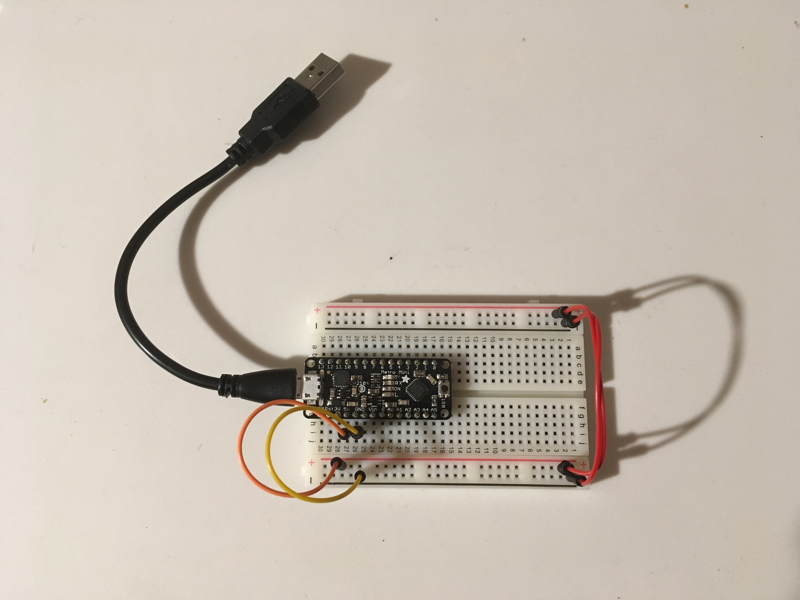

# IDD-Fa18-Lab1: Blink!

**A lab report by John Q. Student**

**Fork** this repository to get a template for Lab 1 for *Developing and Designing Interactive Devices* at Cornell Tech, Fall 2018. You should modify this `README.md` file to delete this paragraph and update below. As the lab asks:

> Include your responses to the bold questions on your own fork of the lab activities. Include snippets of code that explain what you did. Deliverables are due next Tuesday. Post your lab reports as `README.md` pages on your GitHub, and post a link to that on your main class hub page.

We've copied the questions from the lab here. Answer them below!

## Part A. Set Up a Breadboard




## Part B. Manually Blink a LED

**a. What color stripes are on a 100 Ohm resistor?**

Blue, Black, Red
 
**b. What do you have to do to light your LED?**

Setup the circuit, plug the micro controller into power and press the button!


## Part C. Blink a LED using Arduino

### 1. Blink the on-board LED

**a. What line(s) of code do you need to change to make the LED blink (like, at all)?**

Change the pin number in the functions, ```pinMode()``` and ```digitaWrite()```.

**b. What line(s) of code do you need to change to change the rate of blinking?**

Change the value passed into the ```delay()``` function.

**c. What circuit element would you want to add to protect the board and external LED?**
 
Resistors will reduce the voltage flowing into the LED thus protecting the LED. 

**d. At what delay can you no longer *perceive* the LED blinking? How can you prove to yourself that it is, in fact, still blinking?**

Taking a video of the LED will reveal the blinking because our phones' cameras work at a different frame rate then our eyes. 

### 2. Blink your LED

**Make a video of your LED blinking, and add it to your lab submission.**

https://drive.google.com/open?id=19G2yQc_5NZDWFwg-jnu6cuaahtq_uE7s


## Part D. Manually fade an LED

**a. Are you able to get the LED to glow the whole turning range of the potentiometer? Why or why not?**

Yes I am able to get the LED to glow the whole turning range however I'm not entirely sure why.  I am assuming it is because the potentiometer's maximum resistance still allows enough current to activate the LED.

## Part E. Fade an LED using Arduino

**a. What do you have to modify to make the code control the circuit you've built on your breadboard?**

Change the pin number. 

**b. What is analogWrite()? How is that different than digitalWrite()?**

```digitalWrite()``` will send either 0V or 5V where ```analogWrite()``` can simulate voltages between 0V and 5V by sending a square wave of different pulse widths. 

## Part F. FRANKENLIGHT!!!

### 1. Take apart your electronic device, and draw a schematic of what is inside. 

**a. Is there computation in your device? Where is it? What do you think is happening inside the "computer?"**

No there is no computation. It is a toaster.

**b. Are there sensors on your device? How do they work? How is the sensed information conveyed to other portions of the device?**

No there are no sensors.

**c. How is the device powered? Is there any transformation or regulation of the power? How is that done? What voltages are used throughout the system?**

The toaster is powered by a 120V outlet power.  The 120V powers one the filaments which toasts the bread.  Another coil's voltage is regulated by a potentiometer to control how toasted the bread is.

**d. Is information stored in your device? Where? How?**

No.

### 2. Using your schematic, figure out where a good point would be to hijack your device and implant an LED.


**Describe what you did here.**

I figured the simplest way to connect an external light would be to insert a lamp's power cable into the circuit of the toaster coil that was no regulated by a potentiometer.  The toaster's lever acts as a light switch for the lamp.  

Future work: How can I control the light's brightness using the potentiometer? One of the filament circuits has exposed wires... Is this bad / how can fix this?

### 3. Build your light!

**Make a video showing off your Frankenlight.**

https://drive.google.com/open?id=1EqjprbYpvAUJhsz9cZgJKEzC4f3pcyDF

**Include any schematics or photos in your lab write-up.**
